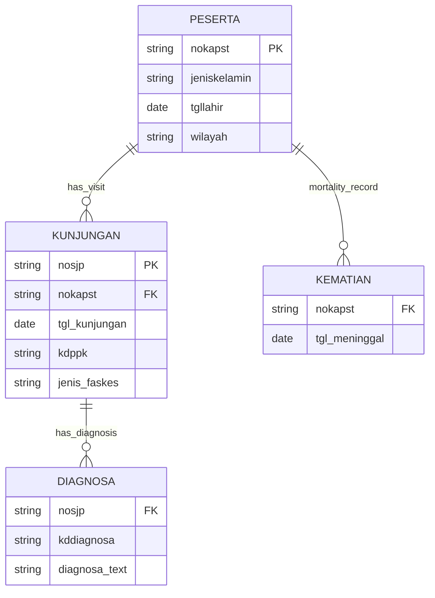

# BPJS Chronic Disease Analytics (BigQuery Data Warehouse)

## Overview

This project builds a healthcare analytics warehouse using Indonesian National Health Insurance (BPJS) claims data.

The goal is to:

* Construct a diabetes patient cohort (2017–2025)
* Detect 30-day visit stability gaps
* Identify high-risk chronic patients
* Predict next-year high-cost members

## Architecture
## Data Model (Entity Relationship Diagram)



## Warehouse Layers

### Raw Layer

Original claim files downloaded from source systems.
No transformation applied.

### Staging Layer

Cleaned and standardized transactional tables:

* Standardized dates
* Removed null patient IDs
* Normalized diagnosis codes

Tables:

* `staging.kunjungan`
* `staging.diagnosa`
* `staging.peserta`

### Mart Layer

Analytical tables designed for population health analysis.

Tables:

* `mart.diabetes_cohort`
* `mart.last_visit`
* `mart.chronic_risk_score`

## Diabetes Cohort Definition

We constructed a longitudinal diabetes patient cohort using claims data from 2017–2025.

### Inclusion Criteria

Patients were included if:

1. Had at least one visit with a diabetes diagnosis code
2. Diagnosis matched predefined ICD diabetes codes
3. Had a valid patient identifier (`nokapst`)

Index date = first observed diabetes diagnosis.

### Exclusion Criteria

Patients were excluded if:

* Diagnosed with predefined severe complications at baseline
* Recorded death before follow-up period

### Follow-up

Patients were followed from index date until:

* Last observed visit
* Death
* End of observation period (31 Dec 2025)

### Outcome Measures

We calculated:

* Last visit date
* Visit continuity
* 30-day stability gap
* High-cost chronic risk indicator

## 30-Day Stability Gap Detection

A stability gap was defined as a period >30 days between consecutive healthcare visits.

We computed visit intervals using window functions in BigQuery:

* Visits were ordered per patient by date
* The difference between consecutive visits was calculated
* Gap >30 days indicates loss of treatment continuity

This metric is used as a proxy for treatment adherence and chronic disease control.

Raw Files → Google Cloud Storage → BigQuery Staging → BigQuery Mart → Analytics / Machine Learning

## Tech Stack

* Google Cloud Storage
* BigQuery
* SQL
* VS Code
* GitHub

## Data Models

### Staging

Cleaned transactional tables derived from raw claims files.

### Mart

Analytical tables:

* Cohort table
* Last visit table
* Chronic risk score

### Analytics

Derived indicators:

* 30-day stability gap
* Readmission risk

## How to Run

1. Upload raw files to GCS
2. Load into staging tables
3. Execute mart SQL scripts

```
bq query --use_legacy_sql=false < sql/mart/mart_cohort.sql
```
